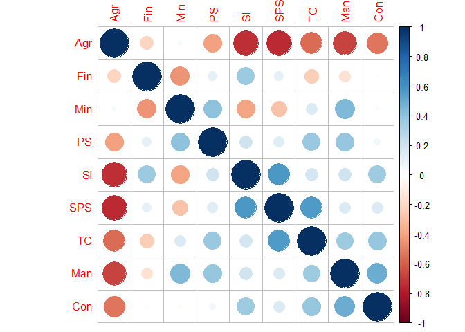
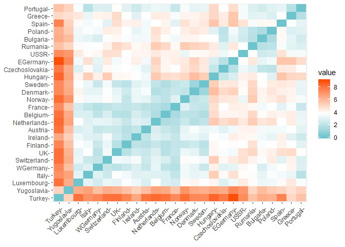
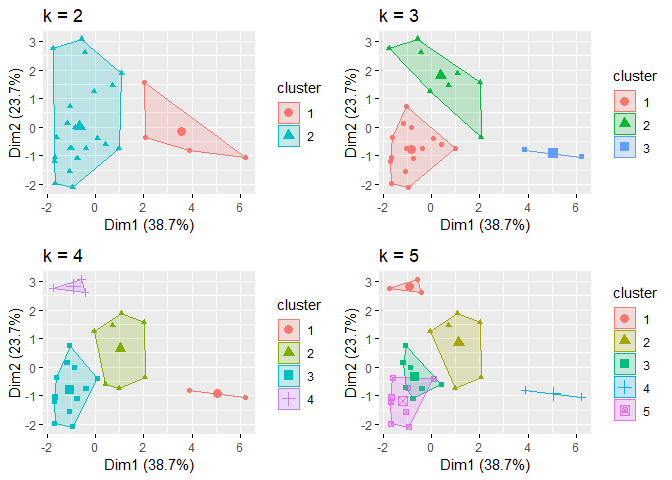
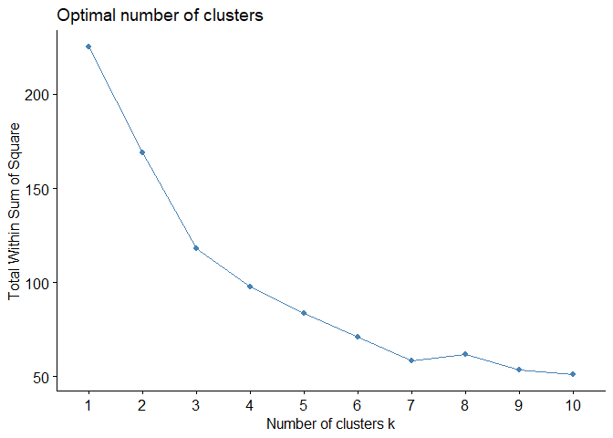
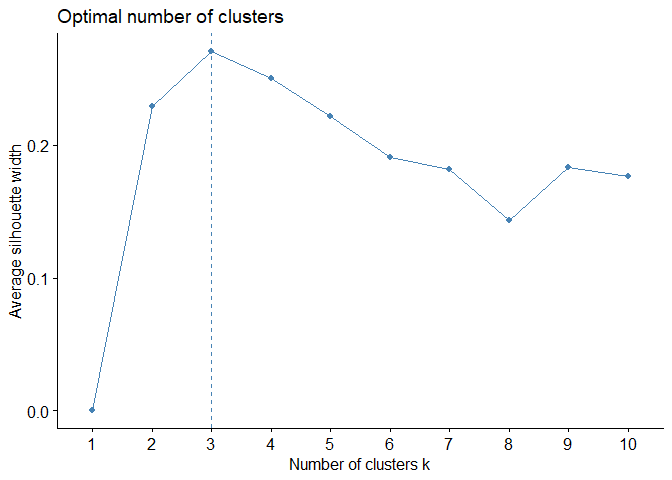
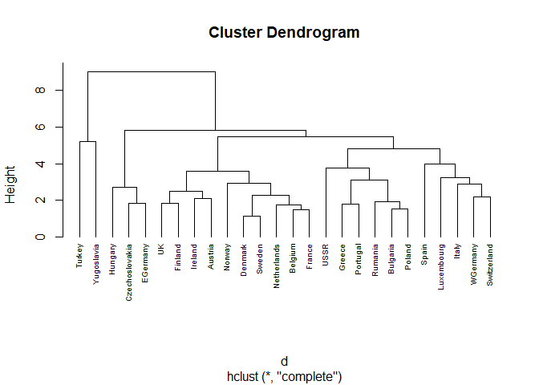
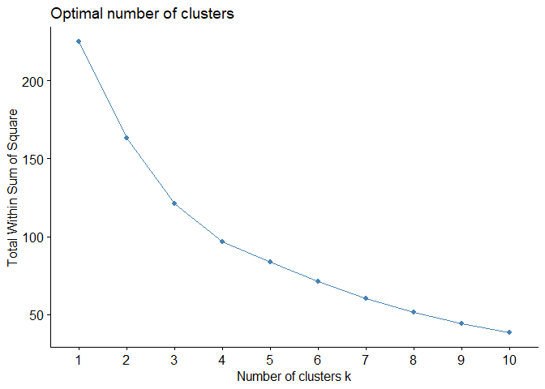
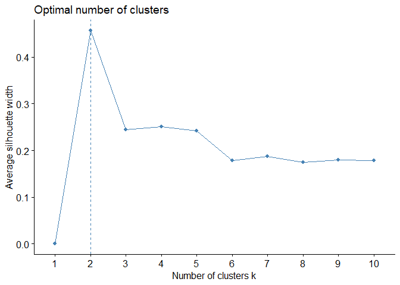
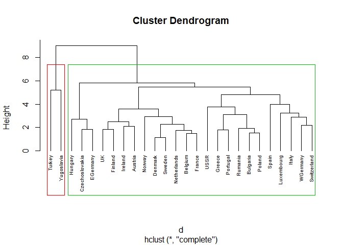
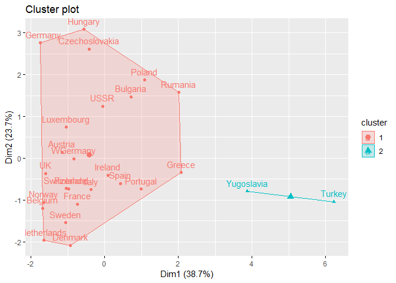

---
title: "Analysis on European Employment Data"
author: "Rohit Bhaya"
output: 
  html_document:
    theme: flatly
    highlight: haddock
    keep_md: True

---

##Introduction
The data consists of the percentage employed in different industries in Europe countries during 1979.
The purpose of examining this data is to get insight into patterns of employment (if any) in European countries in the time period of 1970s.

Variable Names:

* `Country`: Name of country
* `Agr`: Percentage employed in agriculture
* `Min`: Percentage employed in mining
* `Man`: Percentage employed in manufacturing 
* `PS`: Percentage employed in power supply industries
* `Con`: Percentage employed in construction
* `SI`: Percentage employed in service industries
* `Fin`: Percentage employed in finance
* `SPS`: Percentage employed in social and personal services
* `TC`: Percentage employed in transport and communications 

##Packages used

The following packages have been used for the analysis:


```r
library(ggplot2)      
library(dplyr)
library(tidyverse)  # data manipulation
library(cluster)    # clustering algorithms
library(factoextra) # clustering algorithms & visualization
library(dendextend) # for comparing two dendrograms
library(corrplot)
```

##Data Exploration

###Data Import

The Country name column is changed to row name in the dataset.


```r
employment <- read.csv("employment.txt", sep="\t")

#get country name and scale variables
row.names(employment)<-employment$Country
employment <- employment[,-1]
```

###Data Structure

The 9 variables in the data are numeric variables.


```r
glimpse(employment)
```

```
## Observations: 26
## Variables: 9
## $ Agr <dbl> 3.3, 9.2, 10.8, 6.7, 23.2, 15.9, 7.7, 6.3, 2.7, 12.7, 13.0...
## $ Min <dbl> 0.9, 0.1, 0.8, 1.3, 1.0, 0.6, 3.1, 0.1, 1.4, 1.1, 0.4, 0.6...
## $ Man <dbl> 27.6, 21.8, 27.5, 35.8, 20.7, 27.6, 30.8, 22.5, 30.2, 30.2...
## $ PS  <dbl> 0.9, 0.6, 0.9, 0.9, 1.3, 0.5, 0.8, 1.0, 1.4, 1.4, 1.3, 0.6...
## $ Con <dbl> 8.2, 8.3, 8.9, 7.3, 7.5, 10.0, 9.2, 9.9, 6.9, 9.0, 7.4, 8....
## $ SI  <dbl> 19.1, 14.6, 16.8, 14.4, 16.8, 18.1, 18.5, 18.0, 16.9, 16.8...
## $ Fin <dbl> 6.2, 6.5, 6.0, 5.0, 2.8, 1.6, 4.6, 6.8, 5.7, 4.9, 5.5, 2.4...
## $ SPS <dbl> 26.6, 32.2, 22.6, 22.3, 20.8, 20.1, 19.2, 28.5, 28.3, 16.8...
## $ TC  <dbl> 7.2, 7.1, 5.7, 6.1, 6.1, 5.7, 6.2, 6.8, 6.4, 7.0, 7.6, 6.7...
```

###Data Summary

The summary of each variable is shown below.


```r
summary(employment)
```

```
##       Agr             Min             Man              PS        
##  Min.   : 2.70   Min.   :0.100   Min.   : 7.90   Min.   :0.1000  
##  1st Qu.: 7.70   1st Qu.:0.525   1st Qu.:23.00   1st Qu.:0.6000  
##  Median :14.45   Median :0.950   Median :27.55   Median :0.8500  
##  Mean   :19.13   Mean   :1.254   Mean   :27.01   Mean   :0.9077  
##  3rd Qu.:23.68   3rd Qu.:1.800   3rd Qu.:30.20   3rd Qu.:1.1750  
##  Max.   :66.80   Max.   :3.100   Max.   :41.20   Max.   :1.9000  
##       Con               SI             Fin              SPS       
##  Min.   : 2.800   Min.   : 5.20   Min.   : 0.500   Min.   : 5.30  
##  1st Qu.: 7.525   1st Qu.: 9.25   1st Qu.: 1.225   1st Qu.:16.25  
##  Median : 8.350   Median :14.40   Median : 4.650   Median :19.65  
##  Mean   : 8.165   Mean   :12.96   Mean   : 4.000   Mean   :20.02  
##  3rd Qu.: 8.975   3rd Qu.:16.88   3rd Qu.: 5.925   3rd Qu.:24.12  
##  Max.   :11.500   Max.   :19.10   Max.   :11.300   Max.   :32.40  
##        TC       
##  Min.   :3.200  
##  1st Qu.:5.700  
##  Median :6.700  
##  Mean   :6.546  
##  3rd Qu.:7.075  
##  Max.   :9.400
```

```r
employment <- scale(employment)
```

###Checking for Correlation

The following points are observed, basis the correlation of variables:

* Agriculture has negative correlation with Service, construction, Manufacturing industries.
* Transport, manufacturing and construction are also correlated


```r
corrplot(cor(employment), order = "hclust")
```

<!-- -->

###Distance Matrix

On checking the distance matrix between the countries, Turkey and Yugoslavia are separated pretty far from other countries.


```r
#distance matrix
distance <- get_dist(employment)
fviz_dist(distance, gradient = list(low = "#00AFBB", mid = "white", high = "#FC4E07"))
```

<!-- -->

##k-Means Clustering

Clusters are created using K-means clustering algorithm.  For this, different values of k are used and the corresponding results ploted below.  
Turkey and Yugoslavia seem to be pretty far away from other countries as we saw in distance matrix, creating a cluster of their own


```r
#kmeans with diff k vals
k2 <- kmeans(employment, centers = 2, nstart = 25)
k3 <- kmeans(employment, centers = 3, nstart = 25)
k4 <- kmeans(employment, centers = 4, nstart = 25)
k5 <- kmeans(employment, centers = 5, nstart = 25)

# plots to compare
p1 <- fviz_cluster(k2, geom = "point",  data = employment) + ggtitle("k = 2")
p2 <- fviz_cluster(k3, geom = "point",  data = employment) + ggtitle("k = 3")
p3 <- fviz_cluster(k4, geom = "point",  data = employment) + ggtitle("k = 4")
p4 <- fviz_cluster(k5, geom = "point",  data = employment) + ggtitle("k = 5")

library(gridExtra)
grid.arrange(p1, p2, p3, p4, nrow = 2)
```

<!-- -->

###Selecting optimal number of clusters

Using the Total sum of Square method to check for in-cluster similarity, we see a bend at 3 clusters. Hence, we take 3 clusters according to this chart.  
Using average silhouette width method, which gives how well separated the clusters are, we find maximum separation at cluster size 3.  
Hence we proceed with making 3 clusters


```r
#selecting number of clusters
set.seed(12420246)
fviz_nbclust(employment, kmeans, method = "wss")
```

<!-- -->

```r
fviz_nbclust(employment, kmeans, method = "silhouette")
```

<!-- -->

###k-means with 3 clusters

We create 3 clusters on the dataset. The clusters created depends on the starting point, hence we use 25 as the distinct number of starting points.


```r
#creating final kmeans model
set.seed(12420246)
final <- kmeans(employment, 3, nstart = 25)
```

###Profiling the clusters


```r
#comparing cluster wise
k_means_cluster <- cbind(employment, kmeans_cluster = final$cluster)
cluster <- aggregate(k_means_cluster,by=list(final$cluster),mean)
cluster
```

```
##   Group.1        Agr        Min         Man          PS        Con
## 1       1  2.4840999 -0.1585972 -2.09163650 -0.81786082 -2.6223997
## 2       2  0.3526007  0.9496004  0.38775681  0.14568146  0.1121882
## 3       3 -0.4868128 -0.4549756  0.06757616  0.02939187  0.2717058
##           SI        Fin        SPS          TC kmeans_cluster
## 1 -1.5644365  0.7838767 -1.6725978 -2.11729825              1
## 2 -0.9524484 -1.0332921 -0.4097020  0.50582974              2
## 3  0.6717788  0.4186614  0.4139257  0.01174741              3
```

##Hierarchical Clustering

We also try to create clusters using hierarchical clustering method.  
We get the following dendogram highlighting various clusters which can be created. Again Turkey and Yugoslavia have their own cluster. 


```r
# Dissimilarity matrix
d <- dist(employment, method = "euclidean")
# Hierarchical clustering using Complete Linkage
hc1 <- hclust(d, method = "complete" )
# Plot the obtained dendrogram
plot(hc1, cex = 0.6, hang = -1)
```

<!-- -->

###Selecting optimal number of clusters

Using average silhouette width method, which gives how well separated the clusters are, we find maximum separation at cluster size 2.  
Using the Total sum of Square method to check for in-cluster similarity, we dont see a significant bend at until 3 or 4 clusters. But still its not decisive.
Hence we proceed with making 2 clusters


```r
#finding number of clusters
fviz_nbclust(employment, FUN = hcut, method = "wss")
```

<!-- -->

```r
fviz_nbclust(employment, FUN = hcut, method = "silhouette")
```

<!-- -->

We see that one cluster conatins only 2 countries Yugoslavia and other cluster contains the rest.


```r
#creating final model
seed.3clust = cutree(hc1,k=2)
table(seed.3clust)
```

```
## seed.3clust
##  1  2 
## 24  2
```

###Visual Analysis

We show the separation in the dendograms, and also show the plot of the 2 clusters.


```r
#plots
plot(hc1, cex = 0.6, hang=-1)
rect.hclust(hc1, k = 2, border = 2:5)
```

<!-- -->

```r
fviz_cluster(list(data = employment, cluster = seed.3clust))
```

<!-- -->
